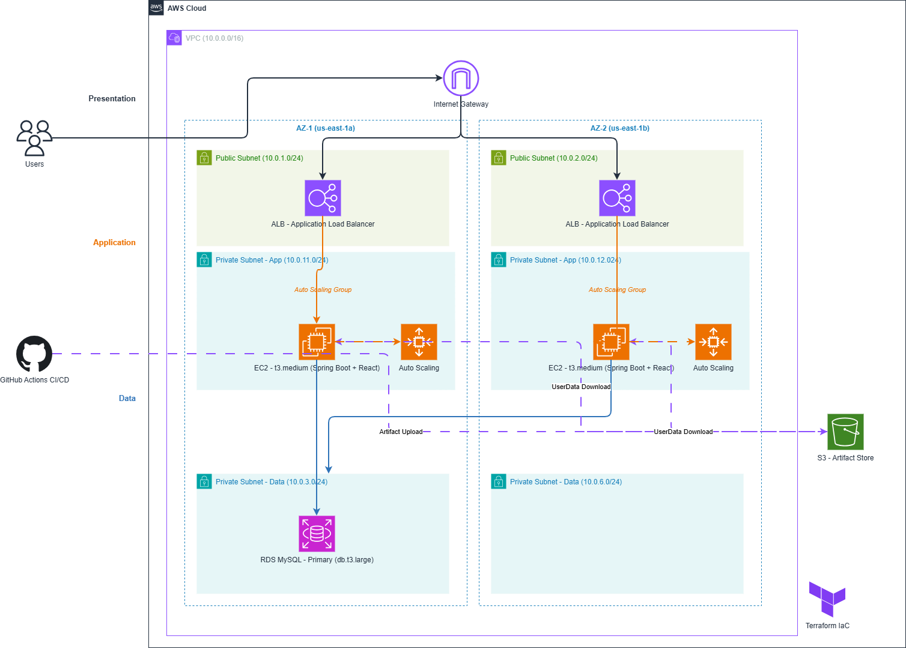

# Terraform AWS Infrastructure for Employee Management Application

## Overview

This repository provisions the complete AWS infrastructure required to run the Employee Management Application using **Terraform**.
The infrastructure follows a **secure and scalable architecture** using a **VPC with public and private subnets, Auto Scaling Group, Application Load Balancer, and RDS database**.
This setup allows the application to run in a production-like environment with high availability and proper network isolation.

---

## Architecture

The infrastructure created includes:

* VPC
* Public Subnets
* Private Subnets
* Internet Gateway
* Route Tables
* IAM Roles
* Application Load Balancer (ALB)
* Auto Scaling Group (ASG)
* Launch Template
* EC2 Instances
* Security Groups
* RDS MySQL Database

### High Level Flow



---

## Infrastructure Components

### VPC

A dedicated Virtual Private Cloud is created to isolate application resources.

### Public Subnets

Public subnets host the **Application Load Balancer**, which receives internet traffic.

### Private Subnets

Private subnets host:

* EC2 instances running the backend application
* RDS database instance

These resources are **not directly accessible from the internet**.

### Internet Gateway

Provides internet access to resources within the public subnet.

### Application Load Balancer

The ALB distributes incoming traffic across EC2 instances in the Auto Scaling Group.

Benefits:

* High availability
* Fault tolerance
* Load distribution

### Auto Scaling Group

EC2 instances are managed by an Auto Scaling Group which ensures:

* Automatic instance recovery
* Scalability
* High availability

The ASG uses a **Launch Template** to start instances with the application.

### RDS Database

An **AWS RDS MySQL instance** is deployed in private subnets to store employee data.

Benefits:

* Managed database service
* Automated backups
* High availability

---

## Prerequisites

Before deploying the infrastructure ensure you have:

* Terraform installed
* AWS CLI installed
* AWS credentials configured
* IAM permissions to create AWS resources

---

## Deployment Steps

Initialize Terraform

```
terraform init
```

Preview infrastructure changes

```
terraform plan
```

Create infrastructure

```
terraform apply
```

Destroy infrastructure (optional)

```
terraform destroy
```

---

## Security Considerations

* EC2 instances run inside **private subnets**
* RDS database is **not publicly accessible**
* Access is controlled using **Security Groups**
* Traffic is routed through the **Application Load Balancer**

---

## Key Benefits of This Architecture

* Scalable infrastructure using Auto Scaling
* Secure network isolation with private subnets
* Managed database with RDS
* High availability with ALB
* Infrastructure as Code using Terraform

---

## Future Improvements

Possible enhancements include:

* NAT Gateway for private subnet outbound access
* HTTPS using ACM certificates
* CloudWatch monitoring and alarms
* Blue/Green deployments
* WAF for application security

---

## Author

Created as part of a **Cloud & DevOps portfolio project** demonstrating Infrastructure as Code using Terraform and AWS.
